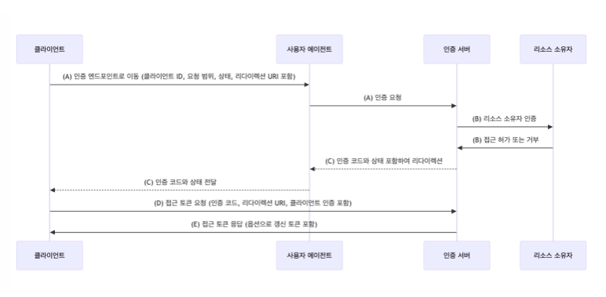

# spring-security

# 1-1단계 - OAuth 2.0 Login

## 요구 사항


- [X] 인증 URL 리다이렉트 필터 구현
> 깃헙 로그인을 위해 깃헙 로그인 버튼을 누르면 깃헙 로그인 페이지로 이동해야한다. 이를 위해, 깃헙 로그인 페이지로 리다이렉트를 시키는 기능을 구현해야 한다.
- [ ] GitHub Access Token 획득
```text
GET /login/oauth2/code/github 요청 시 승인 코드를 받아 Access Token을 요청하는 필터를 작성한다.
Access Token 요청은 다음과 같이 구성된다.
POST https://github.com/login/oauth/access_token
```
- [ ] OAuth2 사용자 정보 조회
> GET https://api.github.com/user 요청을 통해 사용자 정보를 가져오는 로직을 작성한다.

후처리
- [ ] 이후 프로필 정보를 가지고 회원 가입 & 로그인을 구현한다.
- [ ] 기존 멤버 정보가 있는 경우 세션에 로그인 정보를 저장한 뒤 "/"으로 리다이렉트
- [ ] 새로운 멤버인 경우 회원 가입 후 세션에 로그인 정보를 저장한 뒤 "/"으로 리다이렉트

